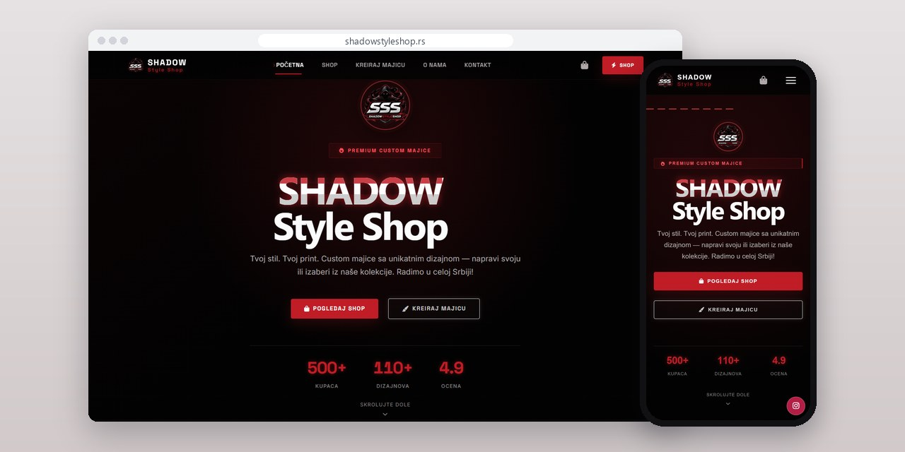
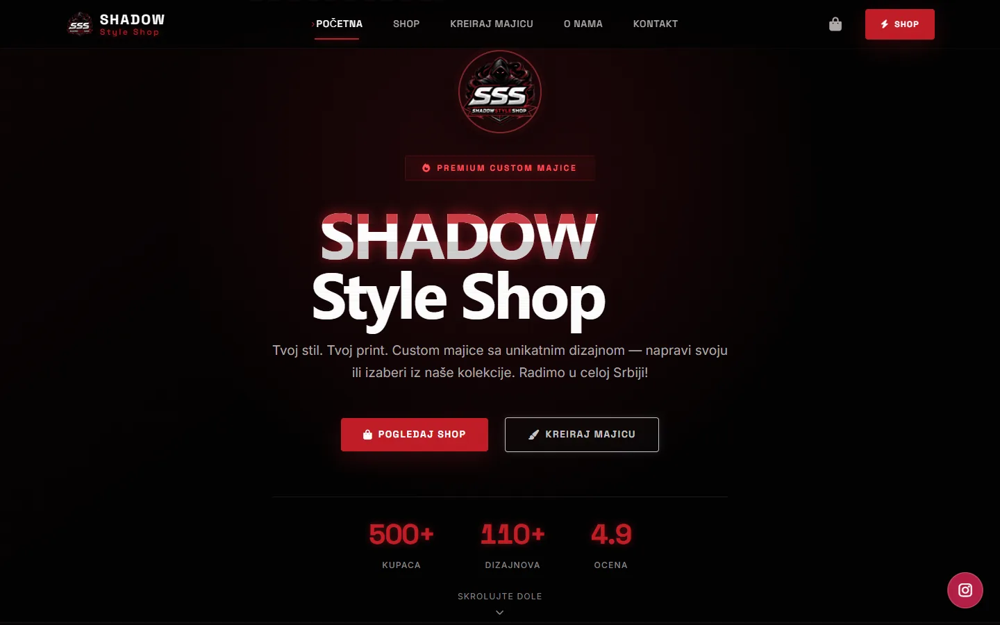
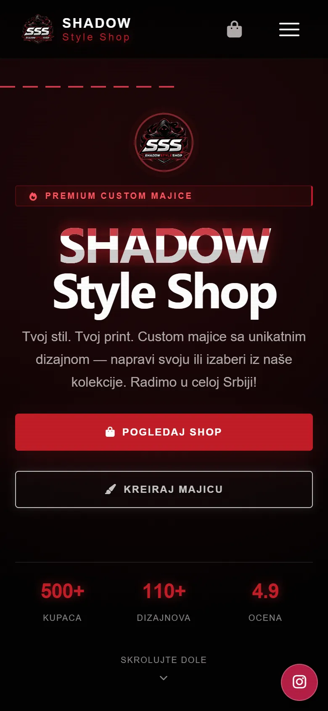
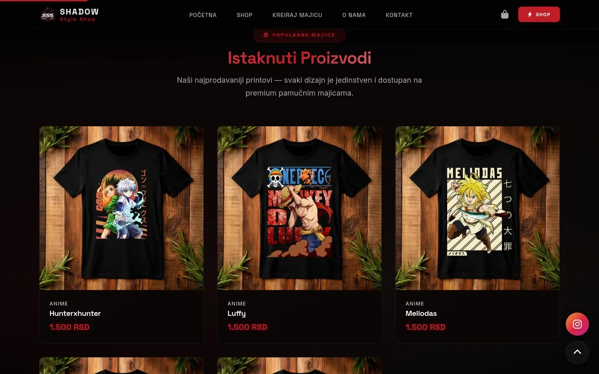
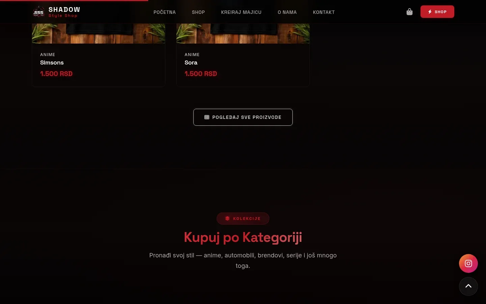

# Shadow Style Shop

Web shop for printed T-shirts with a configurator where buyers place their own design on the front and back before ordering.

**[shadowstyleshop.rs](https://shadowstyleshop.rs/)** · [Case study (in Serbian)](https://svilenkovic.com/radovi/shadow-style-shop) · [Srpski](README.sr.md)

> [!NOTE]
> Client project. The source code belongs to the client and stays in a private repository. This page describes what I built and how.

<table>
  <tr><td><b>Client</b></td><td>Shadow Style Shop</td></tr>
  <tr><td><b>Industry</b></td><td>Printed T-shirts and custom DTF printing</td></tr>
  <tr><td><b>Location</b></td><td>Serbia</td></tr>
  <tr><td><b>Type</b></td><td>Web shop with a product configurator</td></tr>
  <tr><td><b>My role</b></td><td>Design, development, SEO, hosting and maintenance</td></tr>
  <tr><td><b>Stack</b></td><td>PHP 8.3, SQLite, Fabric.js, PWA</td></tr>
</table>

## About the project

Shadow Style Shop sells printed T-shirts online, without a physical store, and prints designs that buyers send in themselves. The catalogue has seven collections and more than a hundred prints, and the owner adds new ones from the panel. No ready-made template handled the custom order well: the buyer has an image and wants to see it on the shirt before paying.

The configurator runs on a Fabric.js canvas, with the library served from the same server. The buyer moves and scales the image over a shirt mockup and picks the shirt colour and print position, separately for front and back. Both sides are exported as images and sent in one request, which gets a reference number and goes into the database. The owner gets it by email with both designs attached and can reply with a quote without opening the panel.

## What I built

- Quantity discount from three shirts up, shown in the cart while you shop; the server works out the final price and ignores any price the browser sends
- Uploads checked by their real content type, whatever the extension says, and stored where they can't be executed
- An admin panel that installs as a PWA, for products, collections, orders, configurator requests and messages
- Messages linked to the shop mailbox both ways: a reply written in the panel goes out as real email, and incoming mail comes back into the same thread
- JPEG, WebP and AVIF made from every uploaded product photo, with the server sending whichever the browser supports
- Clean URLs through a small router, with the .php redirect written so the server's internal rewrite can't loop

## Results

| | Performance | Accessibility | Best practices | SEO |
| :-- | :-: | :-: | :-: | :-: |
| Mobile | 99 | 100 | 100 | 100 |
| Desktop | 100 | 100 | 100 | 100 |

PageSpeed Insights, lab test of the live site, September 2026. Security headers: 6 of 6. HTML validator: no errors. axe accessibility check: no violations. Structured data: `ClothingStore`, `Organization`.

## Screenshots

<table>
  <tr>
    <td width="68%" valign="top"></td>
    <td width="32%" valign="top"></td>
  </tr>
</table>

Featured prints on the homepage

Collections with the number of designs in each

---

Built by [D. Svilenković](https://svilenkovic.com).
